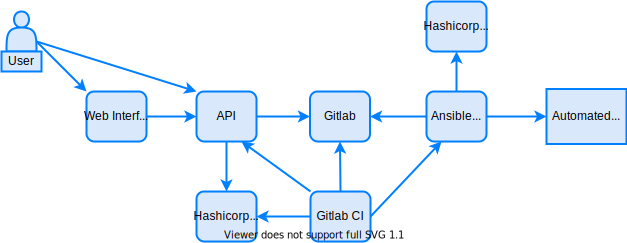

## Introduction {#introduction}

So, this is the first post on a series of automation posts that will be shown here on how to build a Full-Stack automation. In fact it can be used to automate any service, but we'll focus and use network as an example.

This first post will cover the idea of the solution, its architecture, components and other useful information. I'll try my best to not use marketing or specific definitions like SD-WAN, SDN, SaaS, IaaS, etc.

First of all, let's be clear about what is considered "full-stack automation" regarding this series of posts. Full-stack automation is referred as a solution/architecture to fully automate network (or any other services), beginning on the automation itself (eg.: playbooks that will run commands on a Automated Resource) all the way up to a structured data source using gitlab, an API and a WEB interface to be used by final users of the solution.

After building all this architecture, users should be able to access a page, input some information/value in it (eg.: routes, acls, interfaces IP address, etc.) and watch it being deployed by ansible on a Automated Resource (eg.: router)

(###TODO GIF SHOWING THE AUTOMATION)

## The Architecture {#the-architecture}

The architecture presented in this series of posts, which is shown below, is intended to be agnostic of manufacturer and cover any service automation, in a structured, secure and scalable way. Each piece was thought of in a way that can be exchanged by another solution with little/no adjustment on other pieces. You could change gitlab for files, change vault for ansible secrets, change the API programming language to any other that you want, change the web user interface for others you want.

**This series of posts will detail every layer/element of the architecture, also providing a step by step guide on how to install and configure each one of them. In the end you should have a complete functional Full-Stack Automation solution based on this architecture.**

Description of each element/layer:

- The web interface will provide a friendly interface to users where they can list, create, update or delete data from a browser.

- The API will provide a single point of contact for all automation and is responsible to receive user requests on data modifications (eg.: change network interface description), validate the data and send it to gitlab.

- Gitlab is used as a place to store structured data from users (like a database), and also ansible playbooks.

- Gitlab-CI will listen for data modifications on gitlab and call AWX to execute playbooks.

- AWX/ansible will execute playbooks to implement the data modified by users in Automated Resources.

- Hashicorp Vault will store key/pass to access Automated Resources and also key/pass to gitlab.

- Automated Resource is a piece of infrastructure that provides some IT service. It can be a router/switch, a firewall, a hypervisor (eg.: vmware vsphere, openstack), a virtual machine, a container, etc. We'll use a router as an example.

## Why/When to use Full-Stack Automation? {#why-use-archtecture}

When you have services/functions that need to be used by final users to manage a provided infrastructure by you. Examples:

- You are a cloud provider and your users needs a portal/API/console/terraform module to manage the infrastructure you provide (just like current cloud providers: AWS, Azure, Google Cloud, Digital Ocean, etc.);

- You are a service provider and you want(or need) that your users be able to change some configurations remotely for the provided infrastructured using a portal/API. (eg.: create ACLs on a remote router you provide)

- You have an operation team and you want to provide a portal/API to operators to provise or change infrastructure. (eg.: install and manage CPEs on a WAN network)

- You just want to test the architecture or learn more about automation.

## Why/When *NOT* use Full-Stack Automation? {#why-not-use-archtecture}

When you don't need/want to provide infrastructure services in a self-service manner to the end user or When you have a small team that can manage the infrastructure directly.

Either way, the architecture designed can also be used for any cases on any point. You can, for example, just provide access to gitlab files and let your technical team modify direct information and leverage on the CI/CD + AWX solutions to implement it on your infrastructure. You can also provide direct access to AWX so operators just complete a form (normal AWX use).

## Automation Scenario Used {#automation-scenario}

We will use a scenario as an example to implement the Full-Stack Automation architecture described here.

Assertions:

You work on a network service provider that serves WAN connections to several clients.

The network topology has CPEs (routers installed on clients premises) for every remote site that is connected to the provider network and that router connects each client site LAN to your transport network. You are required to allow clients to modify some configurations on these CPEs.

- Clients should be able to change configuration for all CPEs installed on their remote sites.

- Clients must only modify configuration for the LAN interface of CPEs.

- Clients should be able to modify configuration for interface description, interface IP address/subnet, interface ACLs and helper address (DHCP server address).

- Clients should be able to access a web page to make modifications. They should be able to also do these actions through an API.

## System Requirements {#system-requirements}

The simulated architecture will run on a single machine. In a production environment you may need to adjust it by separating elements in different secure segments and adding one or more pieces of softwares as needed. Since it's on a single machine you'll need some good amount of **FREE** RAM memory (around 8GB), and a decent CPU. Since this is a demo, you have the option to use gitlab.com (or other gitlab) instead of intalling one and save about 3-4GB of RAM, just adjust the steps/scripts.

It'll be used docker-compose and some custom scripts to build the solution. You could install it using pure docker or kubernetes, adjusting scripts and files, of course.

You can run the scripts on a VM using a virtual box, another hypervisor (vmware, 'aws', openstack, etc) or use WSL on windows (which is also a VM by the way).