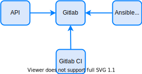

## Gitlab {#gitlab}

Since gitlab is the center of our architecture we'll start by installing and configuring it.

Gitlab is a git source code controller with a nice websystem very similar to github that doesn't need introductions. It has versioning, issues control, tags, auto devops, and a lot of features that you can explore.

<!--truncate-->

:::note
If you do not want to install gitlab and prefer to use gitlab.com or an already existing gitlab (and save 3-4 GB of RAM), you don't need to run the scripts detailed here. Either way, I recommend that at least you read this post.
:::

More about Gitlab can be found on its site: https://about.gitlab.com/stages-devops-lifecycle

## Gitlab Role {#gitlab-role}




Gitlab will be used by the solution for 3 main objectives:
- Store structured data that will be read and manipulated by the API, also keeping historical data/versions.
- Store inventories, playbooks and complementary files (templates, etc.) used by AWX.
- Store the APIs code.

Ideally, for security purposes, you should separate it in 3 or 2 gitlabs, with gitlab-ci not running on the gitlab with ansible files, but for simplicity, will be kept only one.

On full-stack automation, gitlab never talks to any external element and only receives connection from the following elements:
- APIs that need to read/write structured data on repositories.
- AWX that needs to read playbooks/inventories
- Gitlab CI that starts the execution of a pipeline that will call AWX to implement changes.

You may also need to manually send data to it (eg.: modify API source codes or ansible playbooks using git push). Ideally, you should only be able to contact it temporarily for this, and after code update you should block external access (on network, acl, firewall, etc. Not by user/pass, please).


## Gitlab Alternatives {#gitlab-alternatives}

As any other piece of the solution you could replace gitlab with other tools, like github, files, databases or whatever. Also, for the structured data for your API, you could use other specific solutions that should work even better than gitlab.

You could use [Netbox](https://netbox.readthedocs.io/en/stable/) which already has a lot of structured data and a nice API, but it's a little difficult to expand (as of 2021-12). You could also use [Python Eve](https://docs.python-eve.org/en/stable/) which is a data agnostic API interface to a mongodb with features like data validation and format, auto sort/filter, historical data and included race conditions control. Really nice solution and fits perfectly on this architecture. Go check it out.

Remember that changing gitlab with another solution will need adjustment on the CI/CD portion. You can add an MQ (eg.: activeMQ, rabbitMQ) to the architecture that would make you less dependent on gitlab CI and make gitlab more easily replaceable. MQ would be the mechanism that calls AWX and monitor execution (instead of gitlab-ci), and the API itself would post jobs on the MQ. This would also allow you to insert other automations tools besides AWX, since the MQ would be the solution that calls jobs and monitors its execution. It is a good option also.


## Gitlab Installation and Configuration {#gitlab-install-config}

First, if you haven't cloned the architecture repo from github, please do so: ```git clone https://github.com/liviozanol/full-stack-automation```

TL;DR: Simply run the shell script
```
/bin/sh create_gitlab.sh
```

:::note
You need to have docker and docker-compose available. Docker service must be running and healthy (check with ```sudo docker ps``` or similar).
:::

The installation has a docker-compose YAML and a shell script. The shell script is used to create users and access tokens on gitlab that will be used by AWX to get playbooks and also for further scripts to associate gitlab-ci to projects programmatically (and also create the repositories). Note that we are running gitlab only on HTTP. In a production environment you should run it on HTTPS (offloaded or not).

The docker-compose will install and run gitlab and also run a shell script that will create users access tokens to be used further on the solution.

TODO ***LINK [docker-compose.yml](LINK)
TODO ***LINK [create_user_and_access_token.sh](LINK)
