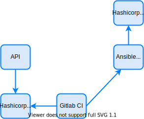

## Harshicorp Vault {#harshicorp vault}

[Harshicorp Vault](https://www.vaultproject.io/) is a solution to secure store and get sensitive information. It has a lot of features, like One Time Password, many auth methods, policies, temp tokens, etc.

For this solution will be used a basic auth with token (no refreshment) to query vault, simple Key/Value will store keys/passwords and policies will be configured to restrict IPs getting information. Of course it can and should be improved, like using temp tokens, other auth methods, lease duration, etc.

<!--truncate-->

## Harshicorp Vault {#vault-role}

The full-stack automation solution will have 2 vaults.



Vault 1 stores secret keys/pass to be used by the APIs, gitlab CI and AWX. 
- APIs need access to read/write on repositories of gitlab. These repositories will store our structured data that the user manipulates.
- Gitlab CI needs an access token to talk to AWX API to start and monitor jobs and playbooks execution.

Vault 2 only stores secret keys/pass that will be used by AWX which are secrets that have access to modify infrastructure resources. A much more sensitive information.

Considering the sensitive data, vault 2 MUST only be accessed by AWX, and should preferably be installed in a specific network/security segment with ACLs/firewall rules permitting only AWX communication. This vault should only store credentials that will be used by the automation engine (ansible/awx).

Also, rules can be used inside Vault that permits reading key/pass only by AWX (IP based) and this will be done in the solution. In this way, even if the access token from AWX is leaked and even if for some reason an attacker can communicate with Vault, it won't be able to get the sensitive key/pass.

On the "demo" solution, for simplicity, the 2 vaults will be on the same host, but in a production environment must be separated. Also, will be used the "dev" "in memory" mode and no TLS, but in a production environment you must, of course, install it with persistent storage and with TLS.


## Harshicorp Vault Alternatives {#vault-alternatives}

You can use other methods or solutions if wanted like: gitlab secret variables; ansible/awx own vault; azure/aws vault; whatever. Harshicorp vault is used because it's a great software with nice API, has enhanced security and is cloud/architecture agnostic. Also it has only one separate function in the solution, so, if needed, it can be easily changeable.


## Harshicorp Vault Installation and Configuration {#vault-install-config}

First, if you haven't cloned the architecture repo from github, please do so: ```git clone https://github.com/liviozanol/full-stack-automation```

TL;DR: Simply run the shell script
```
/bin/sh create_vaults.sh
```

In this guide Harshicorp Vault will be installed using docker-compose.

:::note
You need to have docker and docker-compose available. Docker service must be running and healthy (check with ```sudo docker ps``` or similar).
:::

The installation has a docker-compose YAML and a shell script. The shell script is used to create the key/pass on the 2 vaults that will be used to authenticate on AWX, gitlab and on the automated element. Note that vault is running only on HTTP. In a production environment you should run it on HTTPS (offloaded or not).

The docker-compose will install and run vault.

***LINK [docker-compose.yml](LINK)
***LINK [config_vaults.sh](LINK)