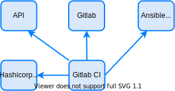

## Gitlab-CI {#gitlab-ci}

Gitlab-CI, AKA Gitlab runner, is a Continuous Integration and Continuous Delivery/Deployment solution built by gitlab. It fully integrates with gitlab listening for changes on repositories and executing pipelines to automate build, test, approve and deploy applications.

It runs on a container and, after a change is triggered, uses docker images to execute steps configured on the pipeline.

More about Gitlab can be found on its site: https://docs.gitlab.com/ee/ci/

<!--truncate-->

## Gitlab-CI Role {#gitlab-ci-role}

Gitlab-CI will be used as the mechanism that starts automation. It will monitor gitlab repositories, detect changes on it and call AWX to implement changes on automated resources (eg.: router). This is its main function, but it will also be used to automatically create containers needed by the API and web interface.

Gitlab-CI talks to almost every component on the solution:
- Calls AWX API to run and monitor jobs/playbook execution;
- Monitor changes on gitlab repositories to run its CI/CD pipelines;
- Create API containers and also talk to them if needed on a pipeline step;
- Get keys/secrets from hashicorp vault 1 if needed on the pipeline and use them to talk to gitlab itself or to talk to full-stack automation APIs.


Gitlab-CI will be running with privileged mode so it can access docker socket and create, update and delete containers on the host itself. This is needed because Gitlab-CI will be responsible for managing API and web interface containers.

For the automation itself gitlab-ci only needs to get data on gitlab and call AWX REST API, so no privileged mode is required and you could use something like [docker in docker](https://hub.docker.com/_/docker) to run it. It is a good idea to separate functions as stated before.




## Gitlab-CI Alternatives {#gitlab-ci-alternatives}

You can change Gitlab-CI to other CI/CD tools very easily. It is important to note that we are using it because of its tighty integration with gitlab itself and we will be able to query the gitlab API to know which step we are in the pipeline so we can notify the user about its request.

So, feel free to use other tools like CircleCI, Jenkins, Travis, whatever.

You could also choose to not use a CI/CD as an element that starts automation. If you decide, for example, to use a solution with python EVE as a database and a MQ to talk to AWX you could have the jobs and approval steps controlled by the API directly with its status stored on python EVE and MQ could be the responsible to query AWX job status and update it on EVE.


## Gitlab-CI Installation and Configuration {#gitlab-ce-install-config}

First, if you haven't cloned the architecture repo from github, please do so: ```git clone https://github.com/liviozanol/full-stack-automation```

TL;DR: Simply run the shell script
```
/bin/sh create_gitlabrunner.sh
```

:::note
You need to have docker available. Docker service must be running and healthy (check with ```sudo docker ps``` or similar).
:::


Installing gitlab-runner is simple as issuing a docker run
```
sudo docker run -d --name gitlab-runner --restart always \
    --privileged \
    -v /var/run/docker.sock:/var/run/docker.sock \
	-v /srv/gitlab-runner:/etc/gitlab-runner:Z \
    gitlab/gitlab-runner:alpine
```

In the next steps, gitlab-runner will be configured to register on gitlab and monitor changes.