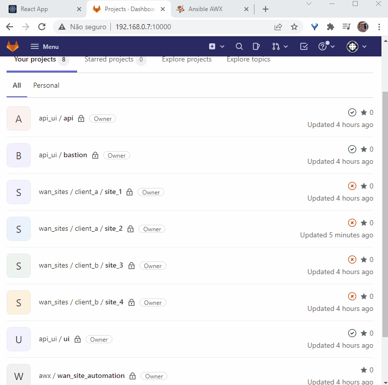

## Demo Introduction {#demo-introduction}

The past 6 posts were about building the infrastructure needed to implement the full-stack automation architecture described.

From now on, we will start to build a demo scenario to use it. As stated on the first post, we will use a scenario as an example and will use the architecture to automate one service.

#### Assertions

Consider these information assertions about you:

You work on a network service provider that serves WAN connections to several clients.

The network topology has CPEs (routers installed on clients premises) that is connected to the provider transport network. You are required to allow clients to modify some configurations on these CPEs.

- Clients should be able to change configuration for all CPEs installed on their sites.

- Clients must only modify configuration for the LAN interface of CPEs.

- Clients should be able to modify configuration for interface description (?), interface IP address/subnet, interface ACLs and helper/DHCP relay address.

- Clients should be able to access a web page to make modifications. They should be able to also do these actions through an API.


Now we can begin to define our service. Let's call it "Wan Sites". You could do something similar with other services, like "DNS records", "VMs", "Containers", etc.

<!--truncate-->

## Defining Structured Data {#structured-data}

Considering the scenario described we can define a data structure that will be manipulated by users. Consider that users may view/change: ip address, description, helper address and ACLs on remote WAN sites.

We can create a structure comprehending these fields. In JSON it can be something like:
```JSON
{
  "site_id": "(string)",
  "custom_site_name": "(string)",
  "lan_interfaces": [
    {
      "interface_name": "(string)",
      "ip_address": "(ipv4/mask)",
      "description": "(string)",
      "helper_address": "(ipv4)",
      "in_acl": [
        {
          "action": "(permit|deny)",
          "src": "(ipv4/mask)",
          "dst": "(ipv4/mask)",
          "protocol": "(tcp|udp|icmp|ip|gre)",
          "port": "(1-65535)"
        }
      ],
      "out_acl": [
        {
          "action": "(permit|deny)",
          "src": "(ipv4/mask)",
          "dst": "(ipv4/mask)",
          "protocol": "(tcp|udp|icmp|ip|gre)",
          "port": "(1-65535)"
        }
      ]
    }
  ]
}
```

We could also start to think on more specific constraints and business rules that our service (and structured data) will have. For example:
- The network only supports IPv4 (for simplicity on this demo).
- custom_site_name is a field used by the client to name its site for its own way of organizing. Must only have letters, numbers, spaces and "-" or "_". Should have a maximum of 20 characters.
- interface_name is a string identifying the interface on the equipment (e.g.: gigabitethernet 0) and must not be edited by users.
- description must only have letters, numbers, spaces and "-" or "_". Should have a maximum of 20 characters.
- ip_address, acl "src" and "dst", must be expressed as ipv4 "/" mask bits (e.g.: 192.168.0.1/32).
- helper_address must have only one ipv4 address (for simplicity in this demo).

ACL specific constraints:
- action must be either "permit" or "deny".
- protocol must be one of the following: tcp, udp, icmp or gre.
- icmp type and code are not supported.
- For protocol types ip, icmp and gre, "port" must be empty.
- For protocol types tcp and udp, ports may be empty (any port), a number (e.g.: 80) or a range separated by a dash (e.g: 22-636).
- Each ACL should have a maximum of 20 ACL rules/lines (aka ACEs).
- src or dst IPs MUST be on interace LAN range. (e.g.: LAN=192.168.0.1/24. dst or src IP MUST be inside this range. (e.g.: 192.168.0.5/32 or 192.168.0.0/24) )


## Gitlab Structure

Since gitlab is being used as the place to store the data for all automated services, we must define how to use its structure to make it easy (and usable) to manipulate data for each of these. Gitlab has a feature called [groups and subgroups](https://docs.gitlab.com/ee/user/group/subgroups/) that allows us to create a hierarchical tree for our projects.

Projects are the places that effectively store versioned files. In this case our structured data will be stored on these projects.

We will use the following hierarchy:
- For every automated service we will create a group.
- For each client/tenant for each service, we will create a subgroup.
- Inside every subgroup we will have projects for each service instance (e.g.: Each CPE Wan Site).

Considering the above, we will have a group called "wan_sites" for our service. Any other service will have a new group (e.g.: "vms", "containers", etc.).
We will also have 2 subgroups: "client_a" and "client_b" (could be any number of subgroups. a.k.a. 'clients/tenants').
For each subgroup we will create 2 projects: site_1, site_2 (client A); site_3, site_4 (client B).
On each project we will store a file named "wan_site_cfg.json" that will store our structured JSON data detailed on the previous topic above.

So, if you want to get data from site_2, you can access the path "https://gilab_url/wan_sites/client_a/site_2/wan_site_cfg.json".

Except for project name (only in our demo), these names and paths aren't visible to the final user, so you can make your own structure and name it the way you want just adjusting your API. Example: client->service->service_instance; service->service_instance (client is a field on each instance).

Using gitlab to store this structured data have a drawback on speed and functionalities, since we are using files to store data (even that they are stored on gitlab), groups/"folders" to separate clients/services and need to make more HTTP requests to get our information. If you need more speed or a more structured way of doing this, you can use something like a database or [Netbox](https://netbox.readthedocs.io/en/stable/) or Python Eve like stated before. [Python Eve](https://docs.python-eve.org/en/stable/) is REALLY good for this, and you can identify resources per client on the data itself without relying on folders/groups (e.g.: a simple field called "client" on the example JSON on the previous section). It also has built-in sort and filter functions using mongodb style query.

Final gitlab structure as shown on web UI


## Creating Gitlab Structure

You can create the structure using the web interface, creating the wan_sites group, clients subgroups, sites projects and manually creating the a dummy wan_site_cfg.json file on each, or you can use the script on the full-stack automation repo (https://github.com/liviozanol/full-stack-automation) and executing the main demo script (sudo /bin/bash ./demo/gitlab/config_gitlab.sh)
