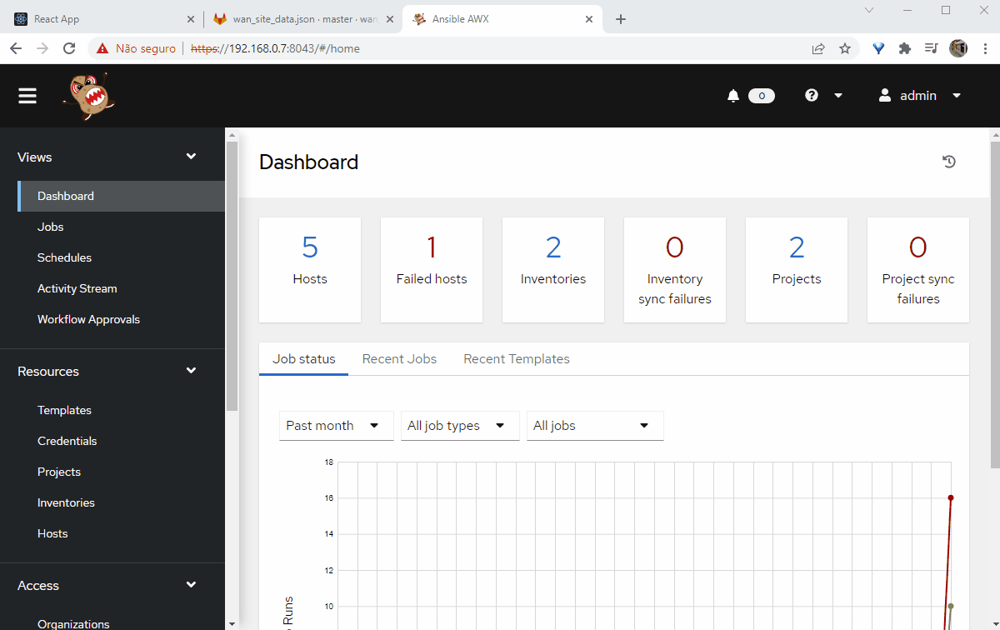

## Creating Playbooks and complements

In the previous post we have defined our structured data and created sample projects on gitlab. Now that our data structure is defined we can start to build our playbooks and templates. In this section we'll build our inventory, templates, workflow and playbook.

All files generated on this section (and on previous) are on full-stack automation github repo (https://github.com/liviozanol/full-stack-automation), so you don't need to create it yourself again.

Ansible/AWX are only the executor of automation tasks and they are never accessed by end-users. So, we don't need to have separation/segregation on a client basis on AWX and you don't need to carry about this. More information about AWX and its role on this architecture can be found [here](full-stack-it-automation-part-4-awx)

Everytime our gitlab repository is changed, gitlab-ci will get the contents of our wan_site_cfg.json file and send it to AWX as a variable, calling a job/playbook/template or a workflow that will implement the changes on our equipments.

After configuring AWX, you should be able to start jobs on it to implement changes on remote WAN sites.

Every file for AWX config to our demo can be found [here](https://github.com/liviozanol/full-stack_automation/tree/master/demo/awx)

<!--truncate-->

## Inventory

On AWX, you can have different inventories for each Project. Considering this, let's define our project being our service in a way that for each service we can have different jobs/playbooks, templates and inventories. You could also use any separation you like (per your company technical areas - good for permission control, per element types, per automation types, etc.).

If you need to use some kind of jump/bastion host to access your devices, you can also define it on this file with variables for all hosts, group of hosts or single hosts. You don't need to (and shouldn't) keep a password/key for the SSH access here, you can just point to a place where the key will be and get it from hashicorp vault. [read more](https://docs.ansible.com/ansible/latest/reference_appendices/faq.html#how-do-i-configure-a-jump-host-to-access-servers-that-i-have-no-direct-access-to)

Since we'll be using a lot of YAML I think it's nice to build the inventory also using YAML, but feel free to use INI as well looking at [reference guide](https://docs.ansible.com/ansible/latest/user_guide/intro_inventory.html).

Our YAML for this wan_site automation project can be like this:
```yaml

all:
  vars:
    dumb_var: you_can_have_you_global_var_here_including_ssh_args
    ansible_user: test #ansible SSH user
    ansible_ssh_common_args: '-o ControlPersist=60s -o ConnectTimeout=300 -o StrictHostKeyChecking=no' #just to test... on production, remove this
    ansible_ssh_private_key_file: ./id_rsa_fullstack.key #Key to use to login
  children:
    ROUTERS_US:
      vars:
        dumb_var2: you_can_have_you_group_var_here_including_ssh_args
      hosts:
        site_1:
          vars:
            dumb_var3: you_can_have_you_host_var_here_including_ssh_args
          ansible_host: 127.0.0.66 #device IP that accepts SSH from ansible (or from bastion/jump host)
          ansible_port: 2222 #SSH listenport
          ansible_connection: network_cli #ansible connection type
          ansible_network_os: ios #variable with device OS that can be used later on our playbook to convert a propper template file
        site_3:
          ansible_host: 127.0.0.1
          ansible_port: 10322
          ansible_connection: network_cli
          ansible_network_os: junos
    ROUTERS_ASIA:
      hosts:
        site_2:
          ansible_host: 127.0.0.1
          ansible_port: 10222
          ansible_connection: network_cli
          ansible_network_os: eos
        site_4:
          ansible_host: 127.0.0.1
          ansible_port: 10422
          ansible_connection: network_cli
          ansible_network_os: iosxr
```

In our example inventory files, remote sites are separated by geographical area, but you can use any separation you want. You can even have a global inventory file maintained by another team that is updated on gitlab by an ansible playbook itself (imagine an initial deploy phase).

The important thing to note here is that the "hosts" names are the ones used to identify on which host jobs/playbooks need to be executed. So, in our demo, *hosts names on inventory (e.g.: site_1) must match the project name on gitlab*. You could use a field on the structured data (or another file) for this and make an internal name/id that is not seen nor edited by the user, but let's keep it simple on the demo.

## Building Playbooks and templates

We will organize our playbooks in a way that we can run commands on equipment depending on its Operating System/type. You could do something more structured using templates, correct ansible modules for each command block (e.g.: acl, interface config, etc.) and also use roles functions separated by OS/type, but I think that a more simple approach is better for maintenance and make you less dependent on ansible and its own organization itself. A point to remember is that, since every change on infrastructure will be made through an API that has strong data constraints, data is already more validated than if we called ansible directly or modifying it via gitlab.

For each type of OS we will have 1 playbook (e.g.: ios_playbook.yml) and 1 template. They will be responsible to convert (a.k.a. parse) our structured JSON data received as variable to commands that needs to be executed on equipment. Since ACLs commands are complex to parse, we'll be using a template to convert it. It receives our ACLs entry and converts it to CLI commands. You could also use something like [Jerikan](https://vincent.bernat.ch/en/blog/2021-network-jerikan-ansible) on the gitlab CI and deliver your data already parsed to ansible so it only executes an action plan instead of parsing.

We will also have a "parent" playbook that simply point to the correct OS playbook depending on "ansible_network_os" variable and use "import_playbook" to import the correct os playbook and a dumb start.yml playbook that only register "ansible_network_os" variable to use on "import_playbook" since we can't access ansible_network_os before import_playbook. These 2 playbooks are the one that we will create job templates on AWX. We will create a workflow template to link these two playbooks.

In this demo we'll only construct an IOS playbook (also runs on IOS XE), but the concept is the same for any OS. Once the workflow and these 2 job templates are created on AWX, to add support to other OSes, all you need to do is to add specific OS playbooks/templates to gitlab repo.

:::note
AWX latest versions have changed a lot from some previous one. Now, playbooks are run on a AWX "Execution Environment" (EE) that basically is a custom container image containing commands and python modules needed. Fortunately, AWX already has a default EE with some modules. Sadly, the default EE doesn't have netaddr python module needed to make some complex network operations more simple (eg.: creating wildcard mask from a normal mask), so we added a "pip install netaddr" as the first task on our playbook and delegated it to localhost.

In a production scenario you should consider building your own EE image with the netaddr module. Or maybe, when/if you build your production environment some guy on AWX EE github repo recognize this problem and accept a pull request inserting this module by default. See [this issue](https://github.com/ansible/awx-ee/issues/90)
:::

```ios_playbook.yml``` example - only modifying the first interface from the JSON file submitted:

```YAML
---
- name: Create ACLs
  hosts: '{{ site_id }}'
  gather_facts: no
  tasks:
  - name: Main Block
    block:
      - name: pip install netaddr (really disagree how red hat manage their products...). Either I do this or create a custom Execution Enviroment....
        ansible.builtin.shell: pip install netaddr
        delegate_to: 127.0.0.1

      - name: Parsing in and out ACEs and setting fact
        ansible.builtin.set_fact:
          in_aces: "{{ lookup('template', './ios_template.j2', template_vars=dict(aces=lan_interfaces[0].in_acl)).splitlines() }}"
          out_aces: "{{ lookup('template', './ios_template.j2', template_vars=dict(aces=lan_interfaces[0].out_acl)).splitlines() }}"
        delegate_to: localhost
              
      - name: Get running config interface section
        cisco.ios.ios_command:
          commands:
            - show running-config | sec interface {{ lan_interfaces[0].interface_name }}
        register: acl_name

      - name: Get ACL IN Name
        ansible.builtin.set_fact:
          in_acl: "{{ acl_name.stdout_lines[0] | select('match', '^\\s*ip\\s+access-group\\s+(.*)in') | map('regex_replace', '^\\s*ip\\s+access-group\\s+(.*)\\s+in.*$','\\1') }}" 
          #this regex will capture the ACL name (a string between word 'access-group' and word 'in')
      - name: Get ACL OUT Name
        ansible.builtin.set_fact:
          out_acl: "{{ acl_name.stdout_lines[0] | select('match', '^\\s*ip\\s+access-group\\s+(.*)out') | map('regex_replace', '^\\s*ip\\s+access-group\\s+(.*)\\s+out.*$','\\1') }}" 

      #To get ansible_date_time and epoch
      - setup:
          gather_subset:
            - min
      #- debug:
      #    var: vars
      #To get ansible_date_time and epoch

      - name: Creating IN ACL
        cisco.ios.ios_config:
          lines:
            "{{ in_aces }}"
          parents: "ip access-list extended wan_site_{{ ansible_date_time.epoch }}_in"
      - name: Creating OUT ACL
        cisco.ios.ios_config:
          lines:
            "{{ in_aces }}"
          parents: "ip access-list extended wan_site_{{ ansible_date_time.epoch }}_out"
      
      - name: Attaching ACL to interface
        cisco.ios.ios_config:
          lines:
            - "ip access-group wan_site_{{ ansible_date_time.epoch }}_in in"
            - "ip access-group wan_site_{{ ansible_date_time.epoch }}_out out"
          parents: "interface {{ lan_interfaces[0].interface_name }}"
      
      - name: Deleting old IN ACL
        cisco.ios.ios_config:
          lines:
            - "no ip access-list extended {{ in_acl[0] }}"
        when: in_acl[0] is defined and in_acl[0] | length > 0
      - name: Deleting old OUT ACL
        cisco.ios.ios_config:
          lines:
            - "no ip access-list extended {{ out_acl[0] }}"
        when: out_acl[0] is defined and out_acl[0] | length > 0
    when: lan_interfaces[0].in_acl is defined and lan_interfaces[0].in_acl | length > 0 and lan_interfaces[0].out_acl is defined and lan_interfaces[0].out_acl | length > 0

- name: Setting other changes
  hosts: '{{ site_id }}'
  gather_facts: no
  tasks:
    - name: Parsing "IP/Mask" to "IP Mask (dot decimal formation)"
      set_fact:
        ip_mask: "{{ lan_interfaces[0].ip_address | ansible.netcommon.ipaddr('address') }} {{ lan_interfaces[0].ip_address | ansible.netcommon.ipaddr('netmask') }}"
      delegate_to: localhost
      when: lan_interfaces[0].ip_address is defined and lan_interfaces[0].ip_address | length > 0

    - name: Changing IP address
      cisco.ios.ios_config:
        lines:
          - "ip address {{ ip_mask }}"
        parents: "interface {{ lan_interfaces[0].interface_name }}"
      when: lan_interfaces[0].ip_address is defined and lan_interfaces[0].ip_address | length > 0
    
    - name: Changing Description
      cisco.ios.ios_config:
        lines:
          - "description {{ lan_interfaces[0].description }}"
        parents: "interface {{ lan_interfaces[0].interface_name }}"
      when: lan_interfaces[0].description is defined and lan_interfaces[0].description | length > 0
    
    - name: Changing Helper Address
      cisco.ios.ios_config:
        lines:
          - "ip helper-address {{ lan_interfaces[0].helper_address }}"
        parents: "interface {{ lan_interfaces[0].interface_name }}"
      when: lan_interfaces[0].helper_address is defined and lan_interfaces[0].helper_address | length > 0

```

```ios_template.j2``` example that will convert our ACLs JSON to IOS commands:
```YAML
#jinja2:lstrip_blocks: True

    {#Check if source or dst IP address are IP/MASK or 'any' and set wildcard mask#}
    
        
    
    
        
    
    {##################}
    {#Make initial statement (e.g.: "permit ip")#}
    {{- item.action }}{{ ' ' + item.protocol -}}
    {##################}
    {#Setting src address (e.g.: "any" or "192.168.254.0 0.0.0.255")#}
    
        {{- ' ' + item.src -}}
    
        {{- ' ' + item.src | ansible.netcommon.ipaddr('network') }}{{ ' ' + src_wildcard -}}
    
    {##################}
    {#Setting dst address (e.g.: "any" or "192.168.254.0 0.0.0.255")#}
    
        {{- ' ' + item.dst -}}
    
        {{- ' ' + item.dst | ansible.netcommon.ipaddr('network') }}{{ ' ' + dst_wildcard -}}
    
    {##################}
    {#Setting dst port (e.g.: "123" or "range 1 123"). If port contains "-" char its a range#}
    
        
        {{- ' range ' + range_initial_port + ' ' + range_final_port -}}
    
        
            {{- ' eq ' + item.port -}}
        
    
    {{ ' ' }}

```

## Storing playbooks, templates and inventories


As stated before, we'll use gitlab to store our ansible files and use it as a source for the AWX project. AWX will query the gitlab repo and update its files (playbooks, inventories, etc.) on demand (or automatically if configured in this way). Also, please note that since this data (playbooks, inventories) have different objectives and requirements from our structured data created in the previous section you should use a separate gitlab or at least use specific permissions to allow only AWX to read this repo (not modify!) and only enable write permissions on an on-demand basis to admins/operators (eg.: update a playbook).

If you have a big automation team or several teams with different roles on IT automation you could have different gitlab repositories with different playbooks, inventories, templates, etc. and each of them only reading/modifying files on their repos. This way you minimize the permission requirements and divide risks.

You can create the repo and submit all files on gitlab using the web interface or git, or you can use the script on the full-stack automation repo (https://github.com/liviozanol/full-stack-automation) and execute the main AWX demo script (sudo /bin/bash ./demo/awx/import_files_on_gitlab.sh)

## Configuring AWX to use inventory, playbook and template

Now, since ansible files are on gitlab we need to configure AWX to integrate with gitlab to get the files and also create our inventory and job templates that will run our playbook ([AWX job template](https://docs.ansible.com/ansible-tower/latest/html/userguide/job_templates.html) is where we link AWX to our playbook). We will also create a workflow to run our playbook because of a Ansible "limitation" on how to manipulate variables on 'import_playbook' directive.

You can do this using AWX web UI, but the [script](https://github.com/liviozanol/full-stack_automation/blob/master/demo/awx/configure_awx.sh) will use AWX API, and will make the following tasks:
- Create a SCM credential (a gitlab deploy token) to allow AWX to login to gitlab.
- Create an AWX project using our gitlab repository.
- Create an inventory using our gitlab repo as a source.
- Create one job template for the playbook that simply gets the network os name from inventory and stores on a variable accessible by other tasks on a workflow.
- Create one job template for the playbook that implements the changes on our router (the main one that 'imports' the real playbook).
- Create a job workflow to link our 2 tasks and link the 2 tasks (these are 4 APIs calls).

AWX final structure shown on its web UI
