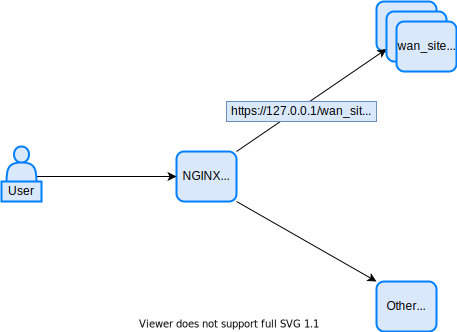
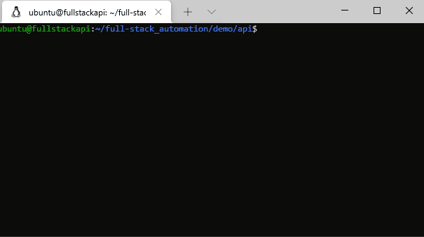

## Service API

In this section we will build our service API. It's responsible to *receive direct user request*, check permissions and if authorized, read and modify files on our gitlab repository.

We will use python as the API language, but as explained before, you could use any language you want that can be built to receive and process HTTP requests. To make things a little faster, will be used [FastAPI framework](https://fastapi.tiangolo.com/). We will try to keep things as simple as possible for the demo, and some funtions may have some minor issues, but on your journey to build a production API you should take more cautions and make things as secure as possible.

After building the API, users should be able to access it using user/pass and view or change information from their WAN site.

All files generated on this section (and on previous) are on full-stack automation github repo (https://github.com/liviozanol/full-stack-automation), so you don't need to create it yourself again.

<!--truncate-->

:::warning
Please, note that in this demo we will use Hashicorp Vault 2 itself to store and verify users authentication and authorization with simple Key/Value and this is not safe/recommended at all. We will create 3 KV secrets in it, each one containing the username, the password and the tenants that each user can access. API simply queries this data and check if passwords match and checks which tenant users belong. Also, queries to the API will use a Basic HTTP Authentication using provided user/pass and that is also not safe and should not be used on production.

On a production environment you *MUST* use other method of authentication/authorzation.

If you already have an auth system you should consider integrating your APIs with it. If its an [OIDC](https://openid.net/connect/)/[OAuth2](https://oauth.net/2/) even better, you can use its own specification to authorize and get users tenant based on custom scopes and it also has it own mean of temporary token exchange to enhace security.

If you want to build your own Auth, you need to get this information elsewhere. I like [this](https://www.youtube.com/watch?v=d4Y2DkKbxM0) simple tutorial using React/GO that even uses JWT to exchange messages to/from API. You could also use some free OIDC as [Ory](https://www.ory.sh/hydra/) to build on premise auth system, and we could have done this on this demo, but would make our demo too big, more than it already is. Python FastAPI have nice features to easily integrate with oAuth/OIDC.
:::

:::note
Please note that I'm not a developer. You shouldn't trust my code blindly (in fact, any code). But feel free to use it, change it and send me angry feedbacks and comments.
:::

API source code for our demo can be found [here](https://github.com/liviozanol/full-stack_automation/tree/master/demo/api)

Bastion configuration for our demo can be found [here](https://github.com/liviozanol/full-stack_automation/tree/master/demo/bastion)

## API structure

When you build APIs you almost always want to think your serevice on a [CRUD](https://en.wikipedia.org/wiki/Create,_read,_update_and_delete) way:
- How do you Create a service instance;
- How do you Read/List your serivce instances;
- How do you Update a service instance;
- How do you Delete a service instance.

Remebering our [service definition](./full-stack-it-automation-part-6-demo-scenario), our service is a WAN site LAN customization that users can change LAN IP addresses, set helper address, ACLs and some other infos. Thinking in a CRUD way would be something like this:
- Create/Enable a WAN site LAN interface (or install/activate/comission whole WAN site CPE, including its PE interface).
- Read/List WAN sites LAN configuration.
- Update/Change WAN sites LAN configuration.
- Delete/Disable a WAN site LAN interface (or desinstall/descomission whole WAN site CPE).

As you can see, Creating/Deleting our service could/should be a staff/operator activity, and we will not cover it on the demo, but if you want, you sure can! You would need to create playbooks involved on these tasks, change your gitlab runner to indetify when to execute each playbook (eg.: by a commit message?), create a way to authenticate/authorize your operators (could even use our Vault user/pass/tenant sctructure - just for a demo, please) and create these functions on the API/UI.

Considering the info above, we will build a [REST API](https://restfulapi.net/) that receives either a HTTP GET(read/list) or PUT(update) request. The API will be stateless and you can scale it horizontally.

We will also use a bastion container using [NGINX](https://www.nginx.com/) that receives our requests and identify to which API endpoint it should redirect it based on path (eg.: http://127.0.0.1/wan_site should go to our demo API). Keep in mind that each API container is responsible for its own auth function, our bastion hosts only pass our requests to the API based on the URL path (eg.: wan_site to wan_site APIs).

You could also add some cache layer if you want using something like [redis](https://redis.io/) if you have some complex automation. 

Everything will be auto deployed by our gitlab runner using a CI/CD pipeline.

The following picture demonstrate our expanded API layer for the demo (we will build a bastion host container and only one wan_site API container, but could be easilly scalable):



Demo with API running


## Bastion NGINX configuration

We will keep bastion host configuration as simple as possible, and you should enhance its configuration if needed and can read more about NGINX configuration [here](https://docs.nginx.com/nginx/admin-guide).

We will use [official alpine nginx docker image](https://hub.docker.com/_/nginx) and create 3 files:

- ```apis.conf``` that will have our proxy_pass redirecting requests containing wan_sites on path to our API. For every API you create, just add a line like this, redirecting to the correct API endpoint. 127.0.0.1 will be replaced by our script with the real IP from our host.
```shell
location /wan_sites {
    proxy_pass http://127.0.0.1:10042/wan_sites;
    include /etc/nginx/conf.d/APIs/default_proxy.conf;
}
```
- ```default_proxy.conf``` that will have our common proxy configuration for every API:
```shell
proxy_http_version	1.1;
proxy_cache_bypass	$http_upgrade;

proxy_set_header Host				$host;
proxy_set_header X-Real-IP			$remote_addr;
proxy_set_header X-Forwarded-For	$proxy_add_x_forwarded_for;
proxy_set_header X-Forwarded-Proto	$scheme;
proxy_set_header X-Forwarded-Host	$host;
proxy_set_header X-Forwarded-Port	$server_port;
	
proxy_connect_timeout 180;
proxy_send_timeout 180;
proxy_read_timeout 180;
```

- ```default.conf``` that is basically own nginx default.conf just adding include clause to import our ```apis.conf```:
```shell
server {
    listen       80;
    listen  [::]:80;
    server_name  localhost;
    include /etc/nginx/conf.d/APIs/*.conf;
(...)
}
```

## API code and server

As stated on the beginning we will use [FastAPI framework](https://fastapi.tiangolo.com/) to build our API. We will publish it using [Uvicorn](https://www.uvicorn.org/) on a container.

You could scale it simply creating more containers and changing nginx bastion host config (if not on kubernetes) to load balance between them (please use [healthchecks](https://docs.nginx.com/nginx/admin-guide/load-balancer/http-health-check)), or use some more structured approaches using [gunicorn](https://fastapi.tiangolo.com/deployment/server-workers) or even more complex structures with cache layers.

The created code is simple and structured in a approach more close to Functional Programming rather than Object Oriented (OOP). It has 3 files:
- [main.py](https://github.com/liviozanol/full-stack_automation/blob/master/demo/api/main.py)
- [check_permissions.py](https://github.com/liviozanol/full-stack_automation/blob/master/demo/api/check_permissions.py)
- [wan_api_functions.py](https://github.com/liviozanol/full-stack_automation/blob/master/demo/api/wan_api_functions.py)

main.py is responsible to handle the HTTP requests, check if user have permissions, and send the requests to the appropriate functions that processes them. If a user send a GET request to the path "/wan_sites" main.py, after checking permissions, will send the request to the function that get sites JSON data from gitlab and return them.

check_permissions.py is responsible to get credentials from the HTTP Authorization header, check if they match the stored one on vault and get the tenants that user has permission. For EVERY request the Auth Header *must* be sent to the API and requests are only processed if they are authorized on vault. Separating the permission check in functions like this, allow us to easially change how this check is done to use other auth providers like OIDC. The function can do whatever you want, just needing to return what tenants does that user has permission.

wan_api_functions.py is our principal file and is the one that we work the most coding. It contains all functions related to the API objective itself. It has functions to get data from gitlab, to list pipeline jobs and its status, to receive UPDATE requests from user and validate it and so on. The biggest and most workly function here is the one that validate the user data on a UPDATE requests. It has a lot of strictly validating rules based on our data definition and is the function that you need to have most care and takes more time to build.

:::note
We have created a new HTTP GET path on our API that will list the last x pipeline jobs and its status. This can be used by the user to check if its UPDATE is finished or not and will also be used on the web UI.

On the UPDATE API path we have configured the function to accept a query string that will make the UPDATE syncronous (wait until the job pipeline is finished) or asyncronous (just UPDATE gitlab file with user data).

We have made a separate validation function for user data because we wanted to make some complex data validation besides simple string/int/boolean/regex one. FastAPI has some good options for simple data validation using strong integration with [pydantic](https://pydantic-docs.helpmanual.io/)
:::

## Deploying Bastion host and API using gitlab runner

As stated before, we will use the same gitlab runner that call AWX to automatic deploy our API and bastion/reverse proxy. On a production environment, the API/bastion gitlab runner should be separated.

Will be created 2 repositories on gitlab: 1 for our bastion host and another for our API. Gitlab runner will watch these repos and update our API or bastion container everytime we modify it.

Again, [our CI/CD pipeline](https://github.com/liviozanol/full-stack_automation/blob/master/demo/api/.gitlab-ci.yml) will be VERY simple, without even testing our application before deploy. Please note that adding more stages with some good tests, validation, approval is very recommended for the APIs and also for UI. For simplicity, also the bastion/API update process will be disruptive (stop old caontainers and running new ones), but you can easilly achieve high availability for the APIs scaling them horizontally and Load Balancing with healthchecks on bastion hosts. Updating the bastion/reverse proxy container  without disrupting it thougha is more difficult.

## Testing the API witch CURL

When the API is deployed you can test its functions using curl like below:

- Listing Client A WAN sites
```curl --user client_a_user:client_a_user 127.0.0.1:10042/wan_sites | jq```

- Getting one specific site from Client B:
```curl --user client_b_user:client_b_user 127.0.0.1:10042/wan_sites/site_3 | jq```

- Updating info for site 1 from Client A asyncronous (please, create CHANGED_FILE.json with your changes):
```curl --user client_a_user:client_a_user 127.0.0.1:10042/wan_sites/site_1?sync=0 -X PUT --data @demo/api/update_test_files/CHANGED_FILE.json```

- List the last 10 jobs for site 1:
```curl --user client_a_user:client_a_user 127.0.0.1:10042/wan_sites/site_1/jobs?number_of_jobs=10 | jq```


