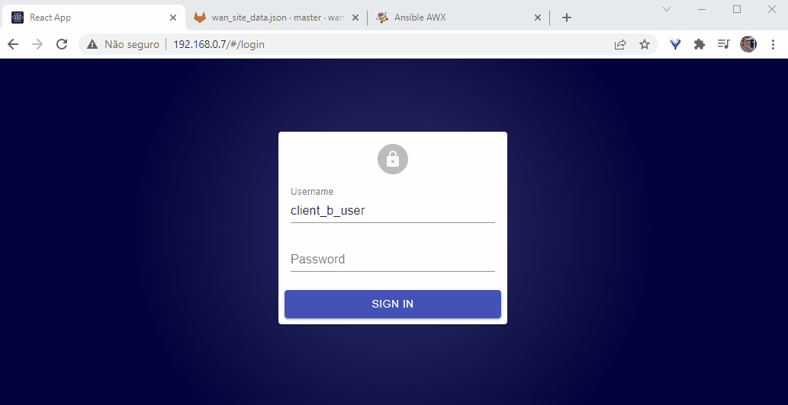

## Web Interface

In this section we will build our web interface. Users can use it to get and update info from their WAN sites in a friendly interface. Note that using web interface is not mandatory. In fact, the web page will only convert data to/from API to show on a page, but users still request our API directly and can use it to make its changes. In some aspect this is good, since you give option to users to use any other tool to interact with our solution. They can use for example [postman](https://www.postman.com), [curl](https://curl.se), ansible, terraform, or even building its own web interface if they want to.

<!--truncate-->

Will be used [react admin](https://marmelab.com/react-admin) as framework to build our UI. Their community version is very complete and allow us to build our pages (if they are basic ones) pretty easy. The Tutorial and Manual are very complete, and if want to deep dive in it go check it out.

React admin is a framework built in [React](https://pt-br.reactjs.org) that lets you build a complete admin dashboard for almost anything using react and Javascript/Typescript (you can also use other [NPM](https://www.npmjs.com/) modules). It integrates with APIs pretty simple and also have a lot of pre-built fields/functions that makes the job of building dashboards much more simple. As UI components, it uses the great [Material UI](https://mui.com/) providing a great visual experience.

It's not part of this post to explain how Javascript/Typescript, NPM or React works as this is a whole world for itself. If want you can learn more about them somewhere else on Internet.

As always, all files generated on this section (and on previous) are on full-stack automation github repo (https://github.com/liviozanol/full-stack-automation), so you don't need to create it yourself again.

:::note
Please note that I'm not a developer. You shouldn't trust my code blindly (in fact, any code). But feel free to use it, change it and send me angry feedbacks and comments.
:::

## Coding the interface


To build our simple web interface using React Admin we need basically these things:
- A file with our [Auth provider](https://marmelab.com/react-admin/Authentication.html) that will receive username/pass as input and validate user permission on the API. Will be named ```authProvider.js```
- A file with our [Data provider](https://marmelab.com/react-admin/DataProviders.html) that will query our API and transform the JSON response from it to a format compatible with react admin. If needed, you can also convert data from react admin format to a format understood by the API before you send to the API (we have done this). Will be named ```dataProvider.ts```
- A file with our Wan Sites functions that will basically have 2 main exported functions: 1 with a [List](https://marmelab.com/react-admin/List.html) of Wan Sites and 1 with the [Edit(Update)](https://marmelab.com/react-admin/CreateEdit.html) view that user will use to edit a Wan Site configuration. We also added react admin simple form validation for each field on the Edit view so user can have a better experience, but this is not required since our API *must* validate the data also. This file will be named ```wanSite.js```
- The ```App.js``` file that will put everything together and make the react admin app available to the user.

On the demo we will use async site update. Once the user submits a change, after validation, data is updated on gitlab and user can make other tasks. So, we need a way to show users if their submitted changes have been implemented on equipment or not and we will create another file for this: ```jobList.js```. This file is a custom React file that shows a table of the last 5 jobs submitted by users and its status. It will be used as an [Aside Component](https://marmelab.com/react-admin/CreateEdit.html#aside-component) on the Edit View that will be shown on the right side of this page to the user.

If you follow [react admin tutorial](https://marmelab.com/react-admin/Tutorial.html) after you create your react app, edit App.js to import authProvider, dataProvider and wanSite, obviously create these files (and jobList), make the ajustment on resources and authprovider on App.js and that's it. You can run your app (```yarn start``` or ```npm run start```) to see it working. If you have access to the API from the computer where you are running the react admin interface you can start to use the app. Login with "client_a_user" (user/pass), "client_b_user"(user/pass) and "admin" (user/pass) to see the differences.


If you look at the source codes of the [files](https://github.com/liviozanol/full-stack_automation/tree/master/demo/fullstack-ui/src) you will see that coding basic things using react admin is pretty simple and the documentation and examples help a lot. But as you start to customize elements, things can get very complicated. If you take a look at ```jobList.js``` that is pratically a custom built element using very few react admin elements, you will see how messy things can become. Either way, React Admin always tries to make things simpler to you and sure is much more easier than build your own admin dashboard from scracth.

UI demonstration after wall is installed and configured


## Publishing our webpage

Just like our API, everything will be auto deployed by our gitlab runner using a CI/CD pipeline.

We will again use the same gitlab runner that calls AWX. On a production environment, the UI and API runner should be separated.

Since we will be using React Admin for our UI, we will use [NPM](https://www.npmjs.com/) to build and install our App. Our repo will contain a ```packages.json``` file that is read by npm and installs the required packages and its dependencies. The output from this build are simple HTML, CSS and JS files that you can even run on your local computer. The CI/CD pipeline will just get these files, and build a simple nginx docker image with then inside, publishing our app just like any simple simple HTML/JS application.

Will be created 1 repository for our react admin source files and packages.json. Gitlab runner will watch this repo and update our UI container everytime we modify it.

Again, our CI/CD pipeline will be VERY simple, without even testing our application before deploy. Please note that adding more stages with some good tests, validation, approval is very recommended. For simplicity, the update process will be disruptive (stop old containers and running new ones). On production environment, obviously, you should make something more suitable for your needs.

:::note
The installation/configuration script will try to guess which IP address is the pyshical IP and change App.js to use it as a dataprovider. If its wrong, you can just update App.js file with the correct IP, either using git operations or gitlab web UI.
:::