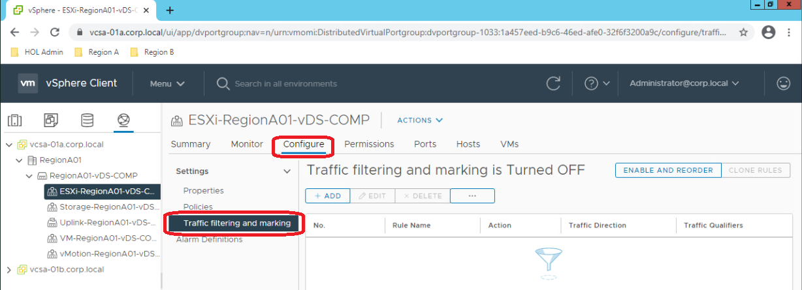
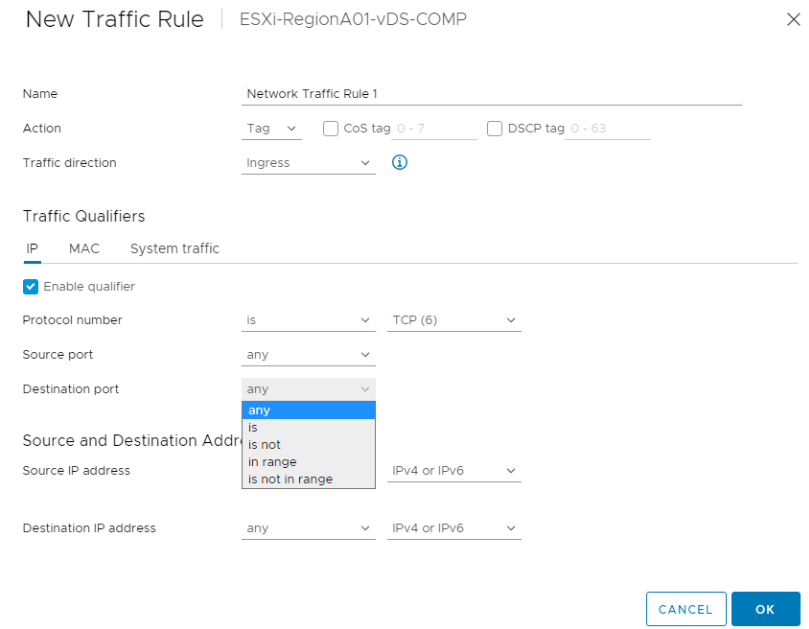

## Intro

VMWare has a nice product called [NSX-T](https://www.vmware.com/br/products/nsx.html) which allows you to build a sort of a cloud provider network infrastructure for your virtualized environment  (and K8s). It has network segmentation, routing, NAT, stateful firewall, IDS, traffic inspection, etc.

What if you already have a good and working cloud-like architecture and just want to insert some simple ACLs directly on the virtualization layer to outsource traffic filtering directly to the hypervisor, and do not want fancy things like firewall, NAT, IDS, etc. ?

vSwitch doesn't support this; NSX-T does, but it is expensive... What about VDS???

Python scripts used available at git repository: https://github.com/liviozanol/vmware_vds_traffic_filte

<!--truncate-->

Well, using vCenter web UI (you can use this [Hands-on Lab](https://www.vmwarelearningplatform.com/HOL/console/lab/HOL-2211-01-SDC-HOL) to check), if you navigate to the VDS itself, and select a portgroup and click configure, you will see that it has some sort of Traffic Filtering. So, despite this almost hidden function (poor UI design in my opinion) it CAN filter traffic.




If you snoop the web interface a little bit you will  see that this looks like a normal network equipment ACL using the classic 5 tuples (src IP, dst IP, L4 protocol, src port, dst port) and input/output direction to apply the filter.



Ok... So, it may be possible to apply filters, but this UI is not helpful at all to create and manage a bunch of ACLs (nor to give end-users permission to apply it). Lets try with the API.

## vSphere API

vCenter has a "new" REST API, launched since version 6.5. But if you look at their [documentation](https://developer.vmware.com/apis/vsphere-automation/latest/vcenter) you will see that it is **very** limited and still needs to be involved to be useful for automation. Hey VMWARE, come on, prioritize vSphere REST API on your product backlog... Oh wait! Maybe you don't want to for some reason?

:::note
*As a side note, NSX-T has a pretty complete, good structured and [well documented REST API](https://developer.vmware.com/apis/976)*
:::

But vSphere also has another "Web Service API" that can be accessed [here](https://developer.vmware.com/apis/1192/vsphere). It is very complete and you will be able to do almost anything with it, and in fact, it is used by ansible VMWare modules. The documentation is not as good as NSX-T and it is not REST, but it is something.

If you search for "DvsTraffic" on Data Object Types, you will find some interesting things. Let's check [`DVSTrafficFilterConfig`](https://vdc-download.vmware.com/vmwb-repository/dcr-public/bf660c0a-f060-46e8-a94d-4b5e6ffc77ad/208bc706-e281-49b6-a0ce-b402ec19ef82/SDK/vsphere-ws/docs/ReferenceGuide/vim.dvs.DistributedVirtualPort.TrafficFilterConfig.html): 
- You will see that it supports one property called `DvsTrafficRuleset`;
- Digging in [DvsTrafficRuleset](https://vdc-download.vmware.com/vmwb-repository/dcr-public/bf660c0a-f060-46e8-a94d-4b5e6ffc77ad/208bc706-e281-49b6-a0ce-b402ec19ef82/SDK/vsphere-ws/docs/ReferenceGuide/vim.dvs.TrafficRuleset.html), it supports `enabled`, some other properties and `DvsTrafficRule` object. Let's go deeper;
- [DvsTrafficRule](https://vdc-download.vmware.com/vmwb-repository/dcr-public/bf660c0a-f060-46e8-a94d-4b5e6ffc77ad/208bc706-e281-49b6-a0ce-b402ec19ef82/SDK/vsphere-ws/docs/ReferenceGuide/vim.dvs.TrafficRule.html) supports `action` which could be used to permit or deny traffic on match (besides other actions). Also supports `sequence`, `direction` and `qualifier` fields. As stated on the page about qualifier:
    - List of Network rule qualifiers. 'AND' of this array of network rule qualifiers is applied as one network traffic rule. If the TrafficRule belongs to DvsFilterPolicy : There can be a maximum of 1 `DvsIpNetworkRuleQualifier`, 1 DvsMacNetworkRuleQualifier and 1 DvsSystemTrafficNetworkRuleQualifier for a total of 3 qualifier.
    - Let's check `DvsIpNetworkRuleQualifier` than...
- Hey! [DvsIpNetworkRuleQualifier](https://vdc-download.vmware.com/vmwb-repository/dcr-public/bf660c0a-f060-46e8-a94d-4b5e6ffc77ad/208bc706-e281-49b6-a0ce-b402ec19ef82/SDK/vsphere-ws/docs/ReferenceGuide/vim.dvs.TrafficRule.IpQualifier.html) supports the 5 tuples!
    - Look! It supports `tcpFlags` also! Maybe we could simulate an 'established' ACL keyword, creating an ACL which matches only segments with ACK and/or RST!
    - Oh no... Look at the description... "*TCP flags are not supported by Traffic Filtering*". Ok, but we can still create traffic rules...
 
:::note
This TCP Flags thing really got me the first time I tried to use DVS filter because this text was only added on documentation for version 7.0... So I tried to use this on the 6.5 version without success but could never figure out the reason that it wasn't working... [Check the old version without this text](https://developer.vmware.com/apis/358/vsphere/doc/vim.dvs.TrafficRule.IpQualifier.html).
:::

So, to effectively apply ACLs on DVS you need to:
- Define the 5 rule tuples using `DvsIpNetworkRuleQualifier`.
- Append it to a `qualifier` on a `DvsTrafficRule`.
- Set `DvsTrafficRule` `description`, `direction` and `action`.
- Append this `DvsTrafficRule` to a `DvsTrafficRuleset`.
- Set `DVSTrafficFilterConfig` with the `DvsTrafficRuleset` you just created.
- Apply `DVSTrafficFilterConfig` to a port group.
- Enable traffic filtering on that port group.


Some questions about this VDS traffic filter rise:
- How many rules can I create?
    - Well, there isn't any documentation about this limit and VMWare **must** provide support to your vSphere even if you apply a long list of rules. Well, at least in theory, but I doubt that if you apply 10.000+ rules on your production environment VMWare will be able to help you...
- Is it stable? How is latency (ms overhead) and throughput (less pps) impacted by rules? What about the bare metal CPU usage (could increase since it's processing traffic to match rules)?
    - Really don't know... You could build some test scenarios to validate.
- Where/When the rules are processed.
    - Don't know... Maybe it is like the DFW rules from NSX-T and they are processed on kernel hooks giving a good performance... But haven't looked for it.
- Can I apply ACLs for an specific VM? Can I apply to uplinks?
    - YES! You can!

:::danger
Be careful when using API to manipulate trafficRules like this. There are some functionalities that are only available through API! If you create some certain kind of rules using API you may be not able to see it on WEB UI! Worst: No errors are shown, but the rules are still there! If you want to delete or edit them, you'll need to do it using the API itself.
:::
 
## Python Scripts

The vSphere API described before is commonly used through an SDK previously built by vmware itself. A lot of people use PowerShell SDK (called [PowerCLI](https://developer.vmware.com/web/tool/12.5.0/vmware-powercli)). I like the python SDK called [pyvimovi](https://github.com/vmware/pyvmomi) which is also used by ansible modules.

I've uploaded 2 scripts to github. The first one lists rules on DVS and the second creates rules on DVS. Could have been only one, but that's ok...

[`list_vds_portgroup_rules.py`](https://github.com/liviozanol/vmware_vds_traffic_filter/blob/main/list_vds_portgroup_rules.py) list rules for a specific portgroup. You pass dvswitch name, portgroup name and rule_id (optional) as argument to the script and all rules for that portgroup is outputted on a JSON formatted string.

[`edit_vds_portgroup_rules.py`](https://github.com/liviozanol/vmware_vds_traffic_filter/blob/main/edit_vds_portgroup_rules.py) edit, create and delete rules for a specific portgroup using a JSON file as source. The JSON file needs to have a specific format. In the following example we intended to create a simple TCP rule on port 53 to google DNS. Keep in mind that [protocol number must follow IANA definition](https://www.iana.org/assignments/protocol-numbers/protocol-numbers.xhtml): (this example is also on script help):
```JSON
[
    {
    "sourceAddress":"any",
    "destinationAddress":"8.8.8.8/32",
    "sourcePort":"1024-60000",
    "destinationPort":"53",
    "protocol":"6",
    "action":"accept",
    "direction":"both",
    "description":"DNS google"
    }
]
```

## Conclusion

vSphere Distributed Switch (VDS), along with other features like QoS, mark, shaping, LACP, etc. also supports stateless traffic filtering using 5 tuples.

Since I never tested it on production, I can't recommend you to do so. If you have some case scenarios for this or have already tested this on a production environment, please, feel free to send some data or feedback so I can share with others.

You could use these scripts to automate VDS using ansible directly (just install pyvimomi) calling it as a "shell" command. Or, you could use it to create an ansible module.

Any feedback is appreciated.